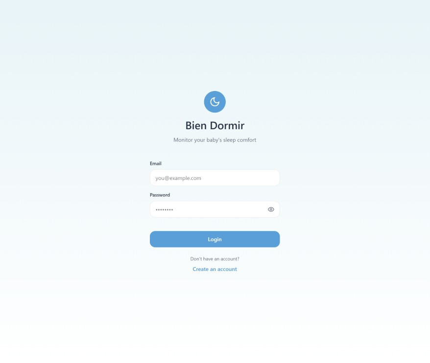
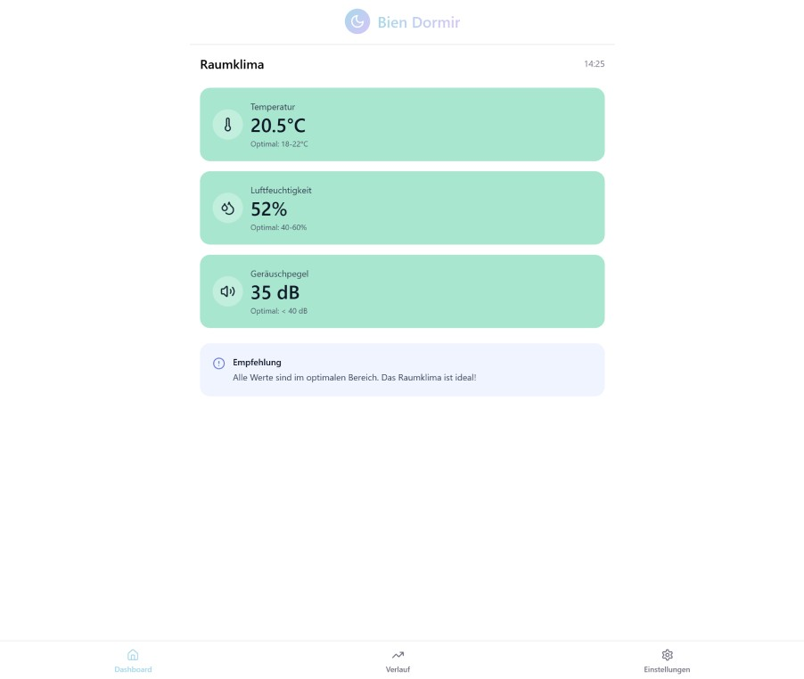
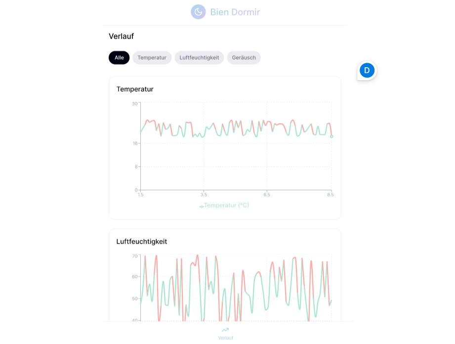
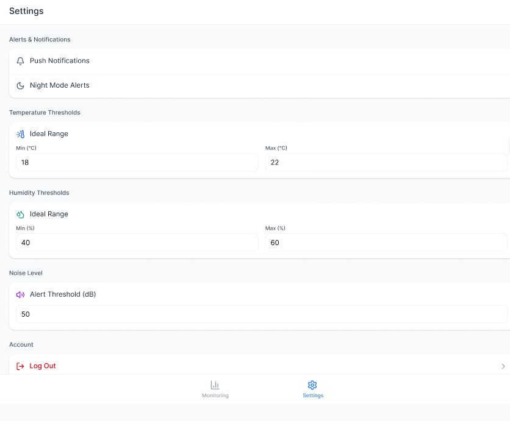

## Kurzbeschreibung des Projekts

* **Modul:** Interaktive Medien 4 an der Fachhochschule Graubünden (FS26)  
* **Themenfeld:** IoT-Applikation zum Thema Eltern mit kleinen Kindern  
* **Name des Projekts:** \[BienDormir\]   
* **Team Physical Computing:** \[Ramon Künzle, Christian Steitz\]   
* **Team WebApp:** \[Davide Pagiusco, Leo Pfyl\]
 
 
* Welches Problem im Alltag von Eltern mit kleinen Kindern wird gelöst? 
* Was ist der „Sinn und Zweck“ des Systems?
    Wir haben ein Produkt entwickelt, das die Luftfeuchtigkeit und Temperatur im Schlafzimmer eines Kindes misst. Mithilfe eines Lautstärkesensors erkennt das System zudem, ob das Kind schläft oder wach ist. Die gesammelten Daten werden in einer Webapp übersichtlich dargestellt und durch Empfehlungen ergänzt, wie das Raumklima optimiert werden kann. So können Eltern gezielt zu einem besseren und erholsameren Schlaf ihres Kindes beitragen.

\[*Bilder / GIFs (optional)*\]

### UX & Konzeption

*In diesem Teil werden die gemeinsamen Schritte aus der UX-Abgabe dokumentiert, damit sich hier alles vollständig an einem Ort befindet (betrifft WebApp und Physical Computing)*

* **Figma:** [Link zum Figma](https://www.figma.com/design/WzXbcX4luVIzrLjMeQ3jk8/IM-4-%E2%80%93-App-Konzeption-Vorlage---Bien-Dormir?node-id=78-325&p=f&t=gTNohZiSQUzWgca7-0)
* **User Flow \+ Screen Flow** (Screenshot aus Figma)
  
  
  
  

* ggf. weitere Ergänzungen
* *Welche Features waren angedacht?*
  Auf der ersten Seite war geplant, dass sich Nutzende zunächst registrieren können. Die eingegebenen Daten werden dabei in einer Datenbank gespeichert, damit anschliessend ein Login möglich ist. Nach dem Einloggen gelangt man auf eine Übersichtsseite, auf der die aktuellsten Messwerte der verschiedenen Sensoren angezeigt werden. Zusätzlich werden direkt Empfehlungen eingeblendet, wie das Raumklima optimiert werden kann, um die Schlafqualität des Kindes zu verbessern.

  Über die Navigation im unteren Bereich der Webseite kann man anschliessend auf die nächste Seite wechseln. Dort werden die Verläufe der letzten Messwerte der einzelnen Sensoren grafisch dargestellt. Eine grüne Linie zeigt dabei einen optimalen Bereich an, während eine rote Linie signalisiert, dass die Werte ausserhalb des empfohlenen Bereichs liegen. Zudem war geplant, dass die verschiedenen Verläufe individuell ein- und ausgeblendet werden können.

  Auf der Einstellungsseite sollten Nutzende Push Notifications sowie Night Mode Alerts konfigurieren können. Ausserdem war vorgesehen, die optimalen Wertebereiche individuell an das jeweilige Kind anzupassen. Abschliessend sollte zusätzlich eine Möglichkeit zum Ausloggen integriert werden.

* *Welche Features wurden nicht umgesetzt? (Warum)*
  Die einzigen Features, die wir schlussendlich nicht umgesetzt haben, waren die Konfiguration von Push Notifications sowie Night Mode Alerts. Wir haben uns dagegen entschieden, da wir diese Funktionen für den eigentlichen Nutzen unserer Webapp nicht als besonders relevant empfanden.

  Stattdessen haben wir eine Profilfunktion integriert, bei der Nutzende ihren Vor- und Nachnamen eingeben können. Diese Angaben werden anschliessend auf der Übersichtsseite angezeigt, wodurch die Webapp persönlicher wirkt und eine individuellere Nutzererfahrung geschaffen wird.
### Setup

* **WebApp:** [Link zur Website](https://biendormir.orusovez.myhostpoint.ch/)  
* **Video-Dokumentation:** [Link zum Video auf Youtube](http://link.zum.video) 

#### Installationsanleitung WebApp

***verständliche** Schritt-für-Schritt-Anleitung für Aussenstehende, um das Projekt zu klonen und auf einem eigenen Server zu installieren*

1. *Was benötige ich an Infrastruktur?*  
2. *Was muss ich auf meinem Webserver installieren?*  
3. *Wie kann ich die Datenbank importieren?*  
4. *Wo muss ich die DB-Credentials eintragen?*  
5. *…*  
6. *Wie nehme ich das physische Artefakt in Betrieb?*

#### Bauanleitung Physical Computing

* ***Was muss ich wie bauen, verbinden, installieren?***  
* *ergänze: **Komponentenplan** (betrifft Physical Computing, vgl. Slides Kapitel 15): Schaubild enthält*  
  * *Die Liste der eingesetzten Komponeten* 
      ESP32 Family Device Board, DHT11 Temperatur- und Luftfeuchtigkeitssensor, INMP441 Mikrofon, Breadboard (unsere Steckplatine), Jumper Kabel (Male/Female Verbindungen), USB-C Kabel, WLAN-Verbindung, Hostpoint Webhosting und MySQL-Datenbank 
  * *die verbundenen Sensoren und Aktoren*  
      DHT-11, der den geräusche Pegel im Raum misst und das INMP441, der den Geräuschepegel im Raum misst und unser Idikator ist, ob das Kind schläft
  * *die Programme (mit Dateinamen)*
      Arduino IDE (FINAL_CODE_MASTER_URL) // Visual Studio Code (save_sensor_data.php / config.php) // phpMyAdmin - sensordaten (My SQL-Datenbank), sftp.json // GitHub
  * *die Kommunikationswege*

* *ergänze: **Steckplan** (betrifft Physical Computing, vgl. Slides Kapitel 15): generiert z.B. mit Fritzing (empfohlen), Tinkercad, Wokwi*  
  * *beachtet die [Fritzing Parts](https://github.com/Interaktive-Medien/im_physical_computing/tree/main/15_Intro_Projektdoku) extra für euch*  
* *ggf. **Bildmaterial***

## technische Details

// Hier sollte das Verständnis ersichtlich sein / Wie stehen die Dateien in Beziehung zueinander, Wie reden Die Dateien miteinander, Wie ist der Weg der Daten

* **Projektstruktur / Code-Struktur:** \[*Hinweis: Der Code selbst muss im Repository liegen und im Kopfbereich jeder Datei eine kurze Zusammenfassung enthalten.*\]  
* **Datenschnittstelle: \[***zwischen WebApp und Physical Computing*\]  
* **ERM:** \[*Erklärung und Schaubild*\]  
* **Authentifizierung:** \[Erklärung\]

## Known bugs

* Was funktioniert noch nicht einwandfrei?
Der verlauf des geräuschpegels sieht noch etwas komisch aus.
* Was ist uns aufgefallen bei der Entwicklung?  
* Was könnte noch verbessert werden?
Darstellung der Verläufe

## Umsetzungsprozess

* **Reflexion / Erfahrung / Lernfortschritt:** *Was haben wir gelernt? Würden wir es nochmal genauso machen? Was war gut, was war schlecht?*
  Im Verlauf des Projekts haben wir gelernt, wie zwei sehr unterschiedliche Welten erfolgreich miteinander verbunden werden können: Physical Computing und Webentwicklung. Besonders spannend war für uns das notwendige Umdenken, das dieses Projekt verlangt hat. Während wir im Bereich Webentwicklung bereits Erfahrungen sammeln konnten, war die Arbeit mit Sensoren, Mikrocontrollern und Echtzeitdaten für viele von uns neu. Dadurch mussten wir lernen, Hardware und Software nicht als getrennte Bereiche zu betrachten, sondern als ein gemeinsames System.

  Eine grosse Bereicherung war die Arbeit mit der Steckplatine und den Sensoren. Das Verständnis dafür, wie Temperatur-, Luftfeuchtigkeits- und Geräuschdaten physisch gemessen, verarbeitet und anschliessend in einer Webapp dargestellt werden können, war für uns sehr lehrreich. Besonders das Auslesen und Weiterverarbeiten der Sensordaten gab uns einen praxisnahen Einblick in interaktive Systeme und zeigte uns, wie digitale Anwendungen mit der realen Welt verbunden werden können.

  Auch im Bereich Webentwicklung konnten wir unser Wissen stark erweitern. Wir lernten, wie Frontend, Backend und Datenbank miteinander kommunizieren müssen, damit Nutzerdaten und Sensordaten korrekt gespeichert und angezeigt werden. Dabei wurde uns bewusst, wie wichtig saubere Datenstrukturen und eine frühzeitige Planung der Datenbank sind.

  Ein weiterer wichtiger Lernfortschritt war das iterative Arbeiten. Viele Funktionen mussten mehrfach angepasst werden, bis sie sinnvoll funktionierten oder benutzerfreundlich genug waren. Dadurch lernten wir, flexibler mit Ideen umzugehen und nicht zu lange an einer Lösung festzuhalten, wenn sie sich in der Praxis als ungeeignet herausstellt.

  Positiv hervorzuheben ist ausserdem die Zusammenarbeit zwischen den beiden Teams. Die Kommunikation funktionierte während des gesamten Projekts sehr gut. Gerade weil Hardware und Webentwicklung eng zusammenarbeiten mussten, war ein regelmässiger Austausch entscheidend. Dadurch konnten Probleme früh erkannt und gemeinsam gelöst werden.

  Rückblickend würden wir einige Dinge anders angehen. Besonders die Speicherung der Sensordaten auf der finalen Datenbank hätten wir früher umsetzen sollen. Zu Beginn arbeiteten beide Bereiche teilweise noch zu getrennt voneinander, wodurch später zusätzlicher Aufwand entstand. Trotzdem half uns genau diese Erfahrung dabei, die Bedeutung einer frühen Systemplanung besser zu verstehen.

* **Herausforderungen & Lösungen:** \[*Verworfene Ansätze, Fehler, Umplanungen*\]
 Eine der grössten Herausforderungen bestand darin, die Kommunikation zwischen Hardware und Webapp zuverlässig umzusetzen. Die Sensordaten mussten korrekt ausgelesen, übertragen, gespeichert und anschliessend in der Webapp aktuell dargestellt werden. Gerade die Verbindung zwischen Mikrocontroller, Datenbank und Frontend führte anfangs zu mehreren Problemen.

  Besonders herausfordernd war die Datenbankstruktur. Zu Beginn wurden die Daten nicht direkt auf der finalen Datenbank gespeichert, wodurch später zusätzliche Anpassungen notwendig wurden. Erst im Verlauf des Projekts wurde klar, wie wichtig es ist, bereits früh mit der endgültigen Struktur zu arbeiten, damit alle Bereiche effizient miteinander verbunden werden können.

  Auch die Verbindung zwischen Frontend und Backend führte zu Schwierigkeiten. Beispielsweise mussten Nutzerdaten wie Vorname und Nachname korrekt gespeichert und anschliessend dynamisch innerhalb der Webapp angezeigt werden. Dabei traten Probleme bei der Aktualisierung und Synchronisation der Daten auf, die durch Debugging und schrittweises Testen gelöst werden konnten.

  Eine weitere Herausforderung war die sinnvolle Darstellung der Sensordaten. Anfangs war unklar, wie die Messwerte möglichst verständlich visualisiert werden sollen. Deshalb entwickelten wir ein Dashboard mit aktuellen Werten, Verlaufsgrafiken und farblicher Kennzeichnung der optimalen beziehungsweise nicht optimalen Zustände. Dadurch wurde die Benutzeroberfläche deutlich intuitiver.

  Im Verlauf des Projekts mussten ausserdem mehrere Ideen angepasst oder verworfen werden. Ursprünglich war geplant, dass Nutzende Push Notifications und sogenannte „Night Mode Alerts“ konfigurieren können. Diese Funktionen wurden jedoch bewusst weggelassen, da sie den Fokus der Webapp unnötig kompliziert gemacht hätten und für den eigentlichen Nutzen keinen entscheidenden Mehrwert boten. Stattdessen konzentrierten wir uns stärker auf die Kernfunktionen wie Messwertanzeige, Verlaufsdarstellung und Benutzerfreundlichkeit.

  Zusätzlich zeigte uns das Projekt, wie wichtig kontinuierliches Testen ist. Viele kleinere Fehler entstanden erst beim Zusammenspiel aller Komponenten und konnten deshalb nicht isoliert erkannt werden. Durch gemeinsames Testen, häufige Anpassungen und offene Kommunikation konnten diese Probleme jedoch Schritt für Schritt gelöst werden. 

* **KI-Einsatz:** *Dokumentation der verwendeten KI-Tools und deren Nutzen (KI ist nicht verboten)*  
  Im Projekt wurden verschiedene KI Tools unterstützend eingesetzt. Dabei diente KI nicht als Ersatz für eigene Arbeit, sondern vor allem als Hilfsmittel für Problemlösungen, Ideenfindung und technische Unterstützung.

  Verwendete KI Tools: Claude/ ChatGPT

  DirektenUnterstützung beim Coden in HTML, CSS, JavaScript und PHP
  Hilfe beim Verbinden von Frontend, Backend und Datenbank
  Unterstützung bei Formulierungen, Dokumentationen und Projekttexten
  Ideenfindung für Userflows, Funktionen und UX Lösungen
  Unterstützung beim Debugging und bei Fehlersuchen

  Der Einsatz von KI half uns dabei, schneller Lösungsansätze zu finden, verschiedene Möglichkeiten zu vergleichen und komplexe technische Zusammenhänge besser zu verstehen. Besonders bei der Programmierung war die Unterstützung hilfreich, da Fehler schneller erkannt und verschiedene Lösungswege direkt ausprobiert werden konnten.

* **Fazit:**
  Das Projekt war für uns eine sehr wertvolle und vielseitige Erfahrung. Besonders die Kombination aus Physical Computing und Webentwicklung machte das Projekt spannend und abwechslungsreich. Wir konnten nicht nur unsere technischen Fähigkeiten erweitern, sondern auch lernen, wie unterschiedliche Systeme sinnvoll miteinander verbunden werden können.

  Durch die Arbeit mit Sensoren, Datenbanken und Webtechnologien erhielten wir einen praxisnahen Einblick in moderne interaktive Systeme. Gleichzeitig konnten wir unsere Teamarbeit, Problemlösungskompetenz und Projektorganisation verbessern.

  Trotz einiger Herausforderungen blicken wir sehr positiv auf das Projekt zurück. Die Mischung aus kreativem Arbeiten, technischem Verständnis und praktischem Nutzen machte die Umsetzung besonders motivierend. Insgesamt hat uns das Projekt gezeigt, wie vielseitig interaktive Medien sein können und wie wichtig eine gute Zusammenarbeit zwischen verschiedenen Fachbereichen ist.
